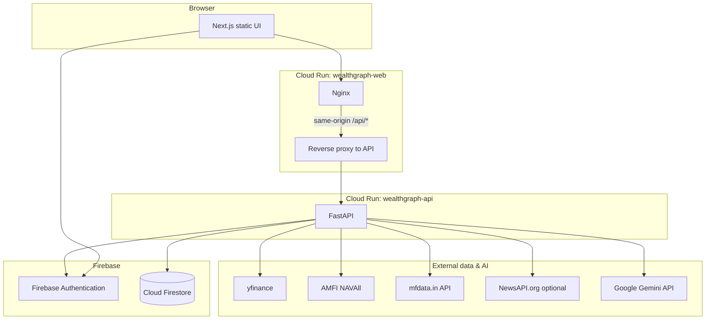

# WealthGraph || AI personal Finance Manager
WealthGraph is a full-stack financial advisory platform that replaces generic investment advice with data-driven, portfolio-specific guidance powered by Google Gemini. Built on FastAPI and Next.js, deployed entirely on Google Cloud Run with Firebase Authentication and Cloud Firestore, it delivers real-time portfolio analysis grounded in actual market data — not textbook platitudes.

The platform retrieves the user's holdings from Firestore, enriches them with live NAV from AMFI, mutual fund analytics (returns, Sharpe ratio, top stock holdings) from mfdata.in, real-time stock snapshots from yfinance, and market news from NewsAPI — then  generate actionable verdicts like "85% HOLD" or "100% SWITCH," citing specific data points and naming alternative funds by their full scheme names.

This is **not** SEBI-registered investment advice. Outputs are educational only.
 ---
### Demo Credentials & Prototype URL
- URL: https://wealthgraph-web-102631486332.us-central1.run.app/
- Email: demouser@gmail.com
- Password: 123456789
- *You can signup and use your credentials as well*

## Architecture



**Request path (typical):** User signs in with Firebase → frontend sends `Authorization: Bearer <ID token>` to `/api/...` (proxied) → FastAPI verifies token → reads/writes that user’s document in Firestore → may call yfinance, AMFI, mfdata.in, NewsAPI, or Gemini and return JSON.

---

## Features

### Authentication & account
- Email/password (and related flows) via Firebase Auth.
- User profile and portfolio stored under the authenticated user in Firestore.

### Overview (dashboard)
- Net worth, invested amount, P&amp;L, cash, **asset allocation** pie chart (equity / mutual funds / cash).
- **Market indices** (e.g. NIFTY, SENSEX, BANKNIFTY) with last session data when markets are closed.
- **Stock** and **mutual fund** holdings tables with live or cached NAV/prices; MF **ISIN**-based NAV where available.
- **Goal progress** from saved goals.
- **AI Insights** — rule-based / LLM-backed alerts tied to policy and portfolio.
- **AI Portfolio Advisor** — calls Live Advisor with a structured prompt; shows reply, recommended actions, and **alternative fund suggestions** (by full scheme name, not ISIN).
- **Market news & your portfolio** — LLM summary of news relevant to holdings (when news + summary are available), with article links in the same card when configured.

### Portfolio
- Edit **cash**, **stocks** (ticker, qty, buy price), **mutual funds** (ISIN and/or AMFI code, units, buy NAV).
- Search/validate tickers and MF schemes via API.
- **CAS JSON** import and optional **CAS PDF** parsing (Gemini) to import MF lines.
- **Valuation** endpoint refreshes marks and caches `lastPrices` in Firestore.

### Goals & limits (policy)
- Goals, risk profile, max drawdown, buffers — used by dashboard insights and advisor context.

### Live AI Advisor
- **Chat** grounded in portfolio + policy JSON sent to Gemini.
- **Voice input** (Web Speech API) and **read-aloud** via Gemini TTS (`POST /advisor/tts`).
- For messages that look like **stock tickers**, backend enriches with **real-time yfinance snapshot** and **news snippets** (if `NEWS_API_KEY` is set) before calling Gemini.
- Answers may cover **non-holdings** (e.g. “should I buy X?”) with a mandatory **non–SEBI-registered** disclaimer.
- **Mutual fund analysis**: `mfAnalysis` block uses mfdata.in (profile + family holdings) when scheme code or name search works.

### Updates (inbox)
- Lists **alerts** and **trade activity** from Firestore; user can clear all.

### Try scenarios (demo)
- Demo-only endpoints to inject cash or simulate a price shock (`isDemo` flag on user).

### Meta / interoperability
- `GET /meta/mcp-tools` — **MCP**-compatible tool manifest mapping to authenticated HTTP routes (for IDE / bridge clients).
- `GET /meta/genai-practices` — honest machine-readable summary: coordinator/sub-steps, **partial** RAG/MCP/A2A, Live Advisor

### Gen AI interoperability 
- **Coordinator + sub-steps:** FastAPI orchestrates valuation, mfdata, yfinance, news, then **one Gemini** reasoning step — not multiple LLM sub-agents.
- **RAG (partial):** structured retrieval from Firestore, AMFI, mfdata.in, yfinance, NewsAPI before generation; **no** vector index; `synthesize_intelligence()` exists but is **not** wired to routes.
- **MCP (partial):** `GET /meta/mcp-tools` HTTP tool manifest only (no stdio MCP server); finance-domain tools, not calendar/tasks/notes unless you add them.
- **External agents:** REST + Bearer auth; **not** the formal Google A2A protocol.


---

## Repository layout

| Path | Role |
|------|------|
| `backend/` | FastAPI app (`app/main.py`), routers, services (valuation, AMFI NAV, mfdata, Gemini, news). |
| `frontend/` | Next.js app (static export), `lib/api.ts`, `lib/cloud-config.ts`, pages under `app/`. |
| `scripts/deploy.ps1` | Build & deploy API image to Cloud Run (requires `GEMINI_API_KEY` in env for full env file path). |
| `scripts/deploy-web-cloudrun.ps1` | Build static site then deploy web container (expects `frontend/out` after `npm run build`). |
| `scripts/verify_cloud_backend.py` | Smoke checks against deployed URLs. |
| `cloudbuild.web.yaml` | Cloud Build for nginx + static frontend image. |

---

## Configuration (environment variables)

Set these on **Cloud Run** (or `.env` locally). **Do not commit secrets.**

| Variable | Used for |
|----------|-----------|
| `GEMINI_API_KEY` | Gemini LLM + TTS for advisor and PDF/CAS parsing. |
| `FIREBASE_PROJECT_ID` / credentials | Firestore + token verification (as configured in `auth_firebase`). |
| `CORS_ORIGINS` | Comma-separated allowed browser origins (see `app/config.py`). |
| `NEWS_API_KEY` | NewsAPI.org — real headlines; without it, placeholders are used. |
| `GCP_PROJECT_ID`, `GCP_LOCATION` | Optional Vertex / GCP defaults. |

Frontend: `NEXT_PUBLIC_API_URL` overrides API base when not using same-origin `/api` proxy.

---

## Local development (outline)

1. **Backend:** Python 3.11+, `cd backend && pip install -r requirements.txt && uvicorn app.main:app --reload`
2. **Frontend:** `cd frontend && npm install && npm run dev`
3. Provide Firebase + Gemini (and optionally News) credentials per your environment.

---

## Deploy (GCP)

See [GCP_SETUP.md](GCP_SETUP.md) if present, and the scripts above. Typical flow:

```powershell
cd frontend
npm install
npm run build
cd ..
powershell -ExecutionPolicy Bypass -File .\scripts\deploy-web-cloudrun.ps1
```

For API, set `GEMINI_API_KEY` then run `scripts/deploy.ps1`, or build the image and `gcloud run deploy` while preserving existing env vars on the service.

---

## Verify deployment

```bash
python scripts/verify_cloud_backend.py
```

Optional auth smoke test (set in shell only; do not commit):

```bash
set WEALTHGRAPH_TEST_EMAIL=your@email.com
set WEALTHGRAPH_TEST_PASSWORD=your-app-password
python scripts/verify_cloud_backend.py
```

---

## Default cloud URLs

| Service | URL |
|--------|-----|
| Web | https://wealthgraph-web-102631486332.us-central1.run.app |
| API | https://wealthgraph-api-102631486332.us-central1.run.app |

---

## Disclaimer

WealthGraph is provided as-is. It does **not** provide SEBI-registered investment advice. Always consult a licensed professional before making investment decisions.
